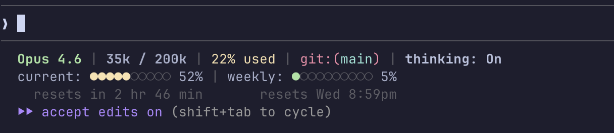

# cc-statusline

Custom 3-line status line for [Claude Code](https://docs.anthropic.com/en/docs/claude-code) showing model, context window, rate limits, and git info.



## Features

- Model name + extended thinking indicator
- Context window usage (tokens + percentage)
- Git branch display
- 5-hour rate limit bar with countdown ("resets in 3 hr 14 min")
- 7-day rate limit bar with day + time ("resets Wed 8:59pm")
- Color-coded bars (yellow current, green weekly)
- 60-second API response caching

## Requirements

### macOS / Linux

- `jq`, `curl`, `python3` (ships with macOS)
- Claude Code with Pro or Max subscription (OAuth)

### Windows

- PowerShell 7+
- `git` in PATH
- Claude Code with Pro or Max subscription (OAuth)

## Installation

### One-line install (macOS/Linux)

```bash
curl -fsSL https://raw.githubusercontent.com/mjanisz/cc-statusline/main/statusline.sh \
  -o ~/.claude/statusline.sh && chmod +x ~/.claude/statusline.sh
```

Then add to `~/.claude/settings.json`:

```json
{
  "env": {
    "CLAUDE_CODE_STATUSLINE": "bash ~/.claude/statusline.sh"
  }
}
```

### One-line install (Windows PowerShell)

```powershell
Invoke-WebRequest -Uri "https://raw.githubusercontent.com/mjanisz/cc-statusline/main/statusline.ps1" `
  -OutFile "$env:USERPROFILE\.claude\statusline.ps1"
```

Then add to `settings.json`:

```json
{
  "env": {
    "CLAUDE_CODE_STATUSLINE": "pwsh -NoProfile -File C:\\Users\\<you>\\.claude\\statusline.ps1"
  }
}
```

### Quick install (any platform)

Paste the script content into Claude Code and ask:

> "Save this as my statusline script and configure it"

### Manual install

1. Download `statusline.sh` (or `.ps1`) to `~/.claude/`
2. Make executable: `chmod +x ~/.claude/statusline.sh`
3. Add the `CLAUDE_CODE_STATUSLINE` env to `~/.claude/settings.json`

## How it works

- Reads JSON context from Claude Code via stdin
- Calls Anthropic OAuth usage API for rate limit data
- Caches responses for 60s at `/tmp/claude-statusline-usage.json`
- Runs as external command — no extra tokens consumed

## License

MIT
